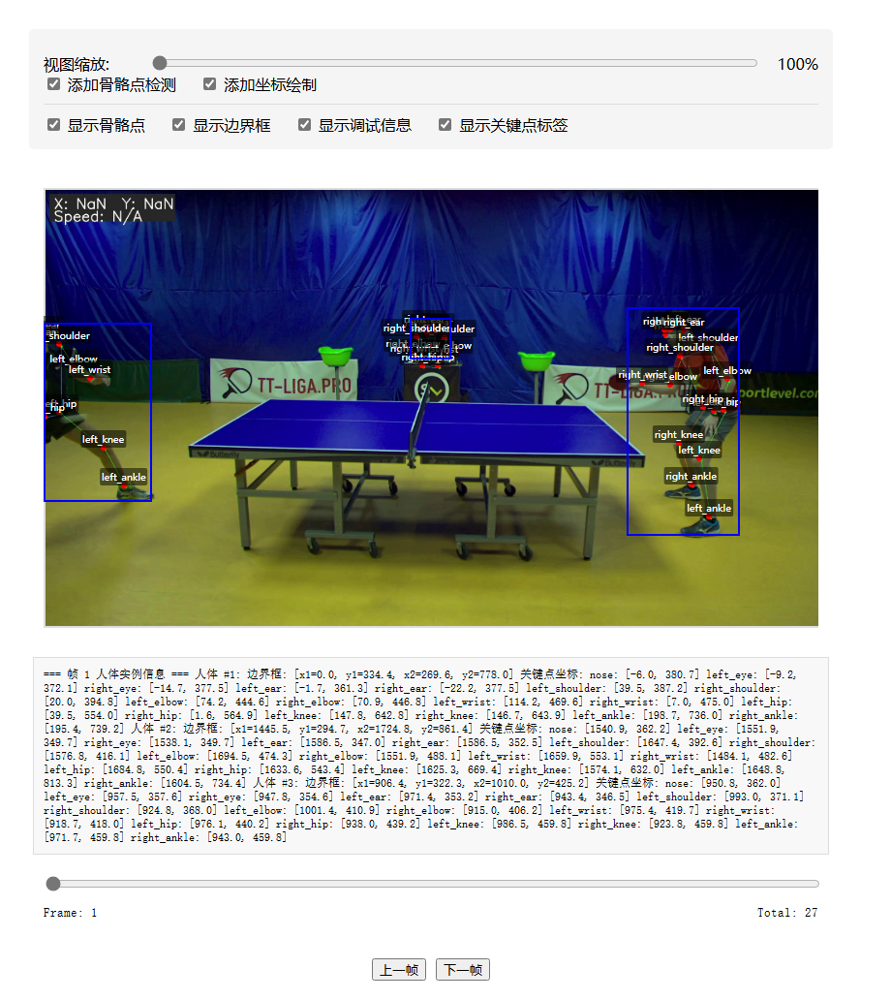
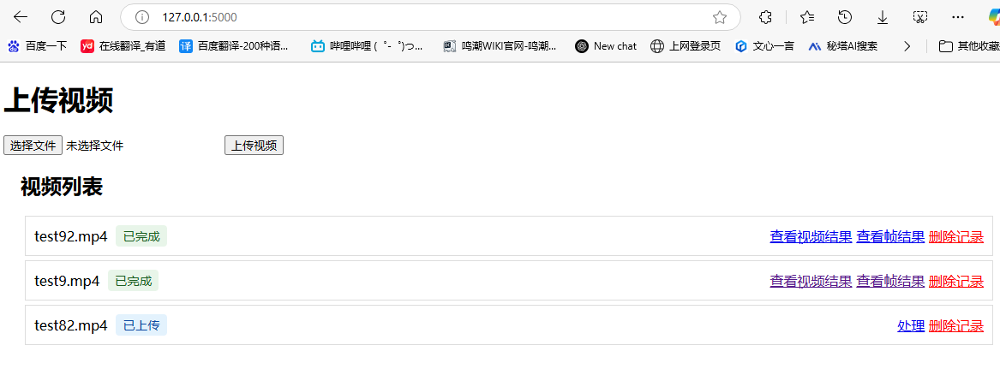
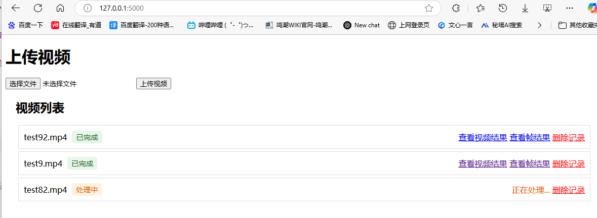
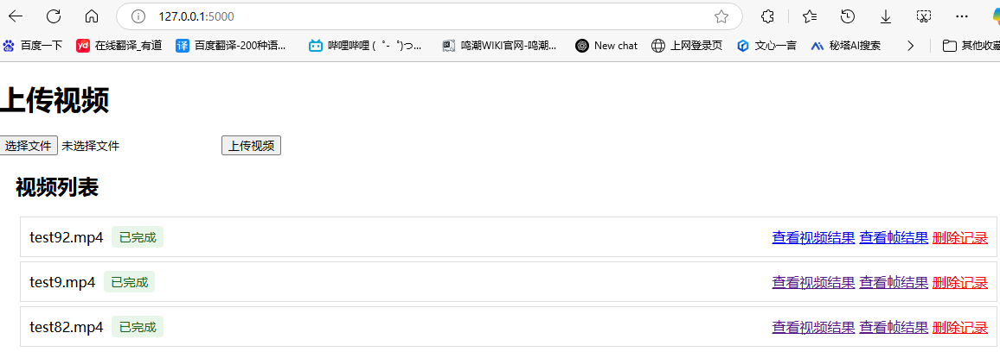
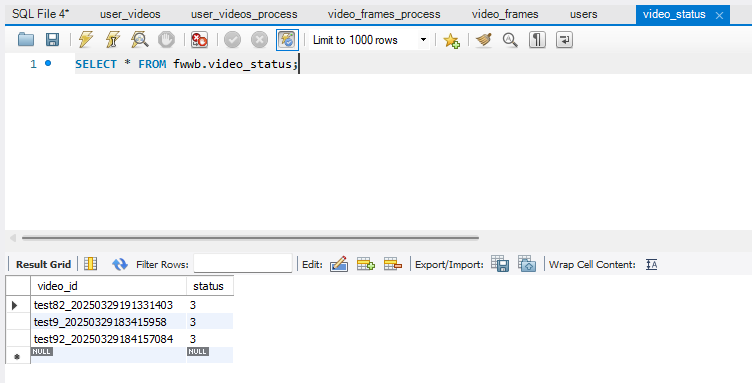
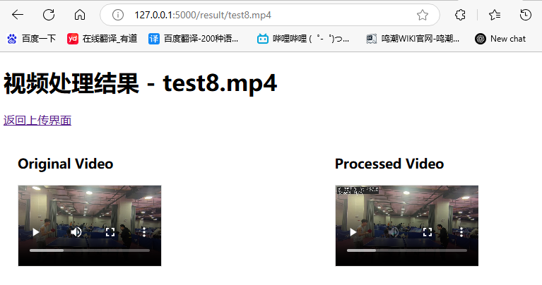
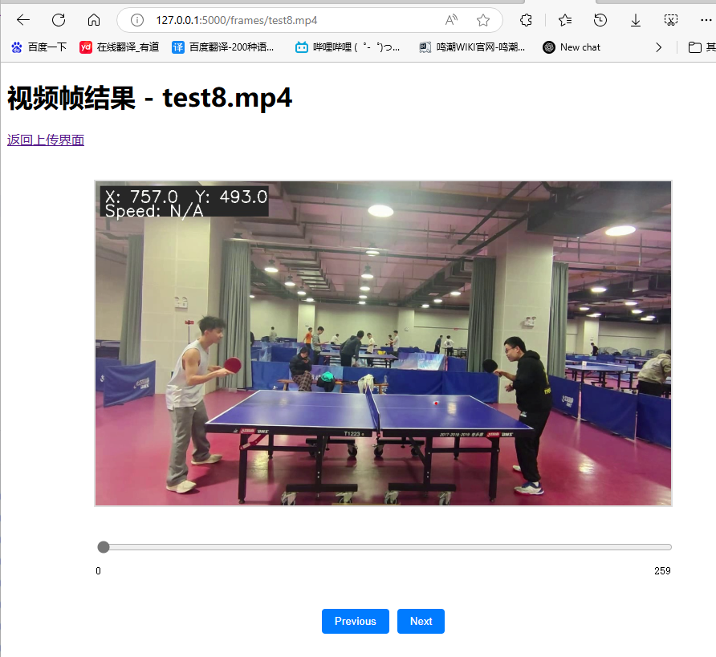
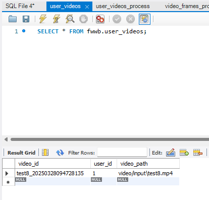
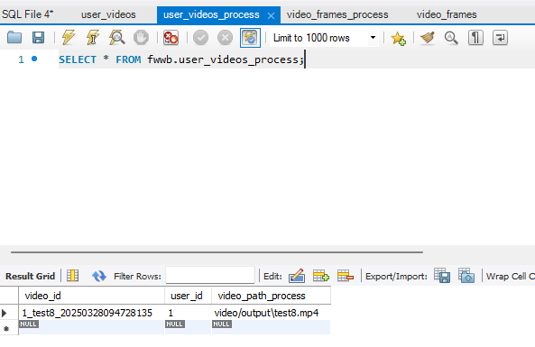
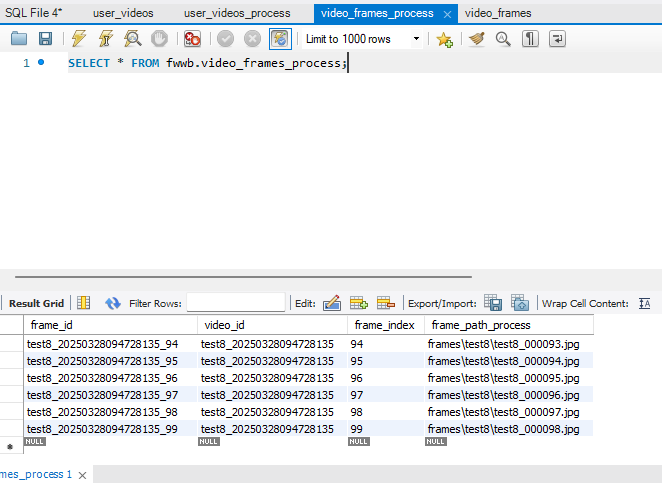

# 基于百度飞桨和文心大模型的智能乒乓球运动分析与可视化设计

# ball_detect使用方法

# V3.31
### 首先，数据库需要按照fwwb.sql的格式创建。
### 增加了新表'video_frames_pose'，用于存储骨骼点处理后的帧信息。

### 增加了骨骼点检测功能。

# V3.29
### 首先，数据库需要按照fwwb.sql的格式创建，增加了新表'video_status'，用于存储视频处理状态。

### 新增功能：视频处理状态自动刷新，
### 处理视频时，系统将每5秒自动检查处理状态，处理完成后将自动刷新页面显示最新结果，无需手动刷新。

### 点击进行处理后，等待响应，响应后有如下界面。

### 状态显示：已上传、处理中、已完成
#### - 已上传：显示"处理"和"删除记录"按钮
#### - 处理中：显示"正在处理..."和"删除记录"按钮
#### - 已完成：显示"查看视频结果"、"查看帧结果"和"删除记录"按钮

### 可以点击"查看视频结果""查看帧结果""删除记录"，同V3.28版本

### 
### 数据库同步更新

# V3.28
### 首先，数据库需要按照fwwb.sql的格式创建，修改video_id和frame_id的类型为varchar(255)
###
### 选择文件上传，将本地内容上传到网站上，拷贝一份到项目路径ball_detect/video/input/*.mp4，

### 点击进行处理后，等待响应，响应后有如下界面
###

###
### 可以点击“查看视频结果”“查看帧结果”“删除记录”
###

###
### 数据库同步更新
###

